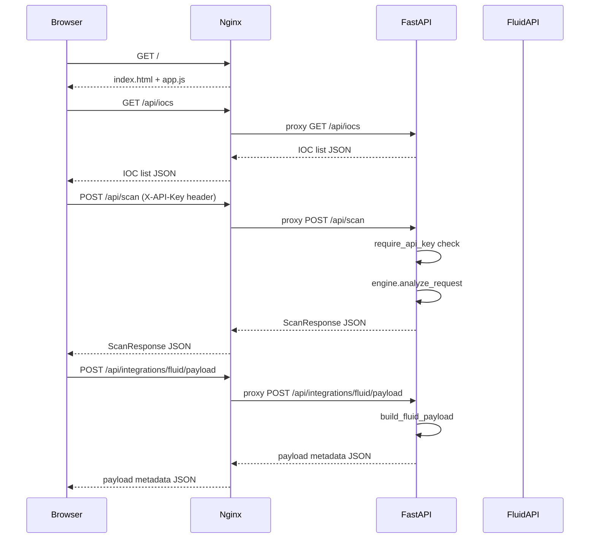

# Operator Control Plane Deployment Guide

This guide describes the deployment contract and operational interfaces for the operator control plane.

## API contract

The full API contract is defined in OpenAPI format:

- [Operator Control Plane OpenAPI Specification](../../api/openapi/operator-control-plane.yaml)

The specification includes explicit endpoint contracts for both generalized and convenience decision flows:

- `POST /v1/approvals/{approval_id}/decision`
- `POST /v1/approvals/{approval_id}/approve`
- `POST /v1/approvals/{approval_id}/deny`

## Deployment requirements

- Expose the API service over HTTPS.
- Enforce JWT bearer authentication for all endpoints.
- Ensure role claims map to one of: `operator`, `reviewer`, `admin`.
- Enforce endpoint-level role checks using each operation's `x-required-roles` metadata.
- Configure immutable audit event storage (append-only semantics).
- Preserve tamper-evident hash chaining fields (`previous_event_hash`, `event_hash`) on persisted audit records.
- Propagate `correlation_id` through all command and event workflows.

## Operational domains

- **Approvals**: pending approvals queue, decisioning, and justifications.
- **Incidents**: skill quarantine, credential revocation, publisher disablement, and timeline replay.
- **Audit**: immutable event read API for compliance and forensics.
- **Access control**: role model introspection endpoint.

## Runtime request flow

### Security hardening requirements for this flow

- **Browser rendering safety**: never render analyzer output using raw `innerHTML`; escape content or use safe text bindings to prevent XSS.
- **Integration credential safety**: do not return masked `Authorization` values to the browser for replacement; keep Fluid API credentials server-side and invoke Fluid API only from backend services.
- **Gateway policy**: Nginx should pass through only required headers and strip unexpected auth-related headers from browser-originated integration requests.
- **Auditability**: record `correlation_id` and actor identity for scan and integration operations to preserve traceability.
